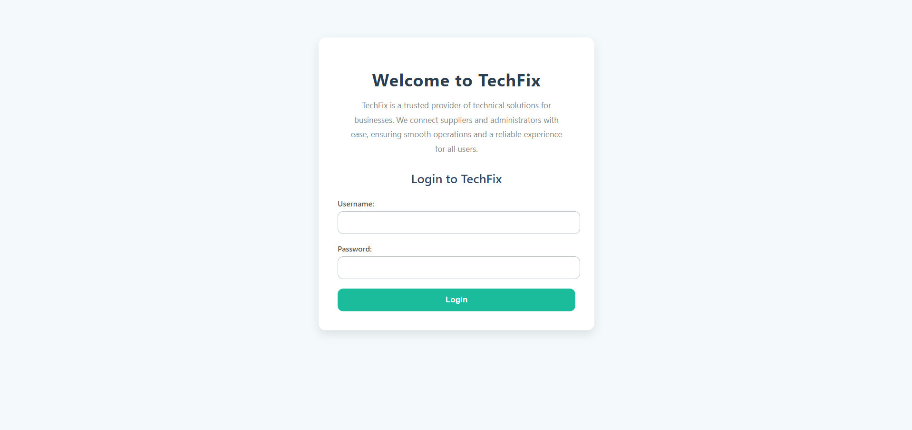

# TechFix 3.0

TechFix 3.0 is a web-based management system designed to streamline the operations of a tech solutions company. It provides dedicated dashboards for both administrators and suppliers, enabling efficient management of products, orders, inventory, users, and sales reporting. The system is developed using ASP.NET Web Forms and integrates multiple service references for handling data operations across various modules.

## Features

- **Admin Dashboard**: Provides a centralized interface for administrators to manage users, inventory, and orders efficiently.
  - **Manage Users**: Add, edit, or remove users with role-based access controls, ensuring only authorized personnel can make changes.
  - **Manage Inventory**: Track stock levels, update product details, and manage inventory seamlessly.
  - **Order Summary**: View and track all orders, monitor their status, and handle processing tasks.

- **Supplier Dashboard**: A dedicated platform for suppliers to manage their product listings, orders, and sales analytics.
  - **Product Management**: Add, edit, and delete products, ensuring inventory is up-to-date.
  - **Order Management**: Track order statuses, update processing, and notify customers.
  - **Sales Reporting**: Access detailed sales reports to monitor product performance and sales trends.

## Project Structure

```plaintext
TechFix3.0/
│
├── TechFixV3.0Client/
│   ├── Admin/
│   │   ├── AdminDashboard.aspx
│   │   ├── ManageInventory.aspx
│   │   ├── ManageUsers.aspx
│   │   ├── OrderSummary.aspx
│   │   ├── AdminMaster.master
│   ├── Supplier/
│   │   ├── SupplierDashboard.aspx
│   │   ├── ProductStore.aspx
│   │   ├── OrderManagement.aspx
│   │   ├── SalesReport.aspx
│   │   ├── SupplierMaster.master
│   ├── Content/
│   │   ├── admin.css
│   │   ├── login.css
│   │   ├── supplier.css
│   ├── Login.aspx
│   ├── packages.config
│   └── Web.config
│
├── TechFixV3.0WebServices/
│   ├── AuthenticationService.asmx
│   ├── InventoryService.asmx
│   ├── OrdersService.asmx
│   ├── ProductService.asmx
│   ├── ReportsService.asmx
│   ├── UserService.asmx
│   ├── packages.config
│   └── Web.config
│
├── .gitignore
├── README.md
└── TechFixV3.0.sln
```

## Screenshots

### Admin Dashboard


### Manage Users


### Manage Inventory


### Order Summary


### Supplier Dashboard


### Product Store


### Order Management


### Sales Report


### Login Screen


## License

This project is licensed under the MIT License. See the LICENSE file for details.

### Contact

- Author: Hiruna Gallage
- Website: [hiruna.dev](https://hiruna.dev)
- Email: [hello@hiruna.dev](mailto:hello@hiruna.dev)
